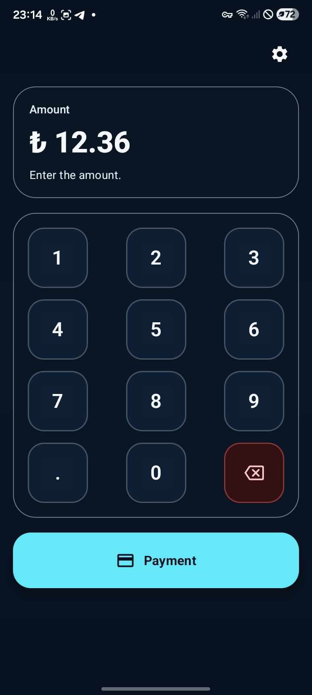
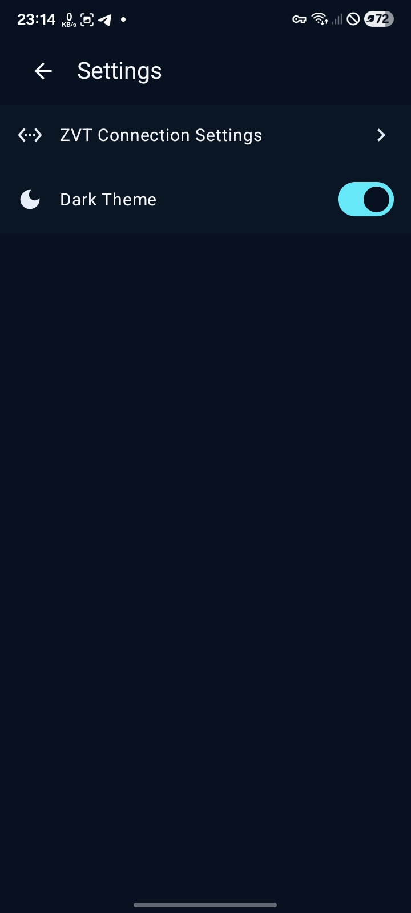
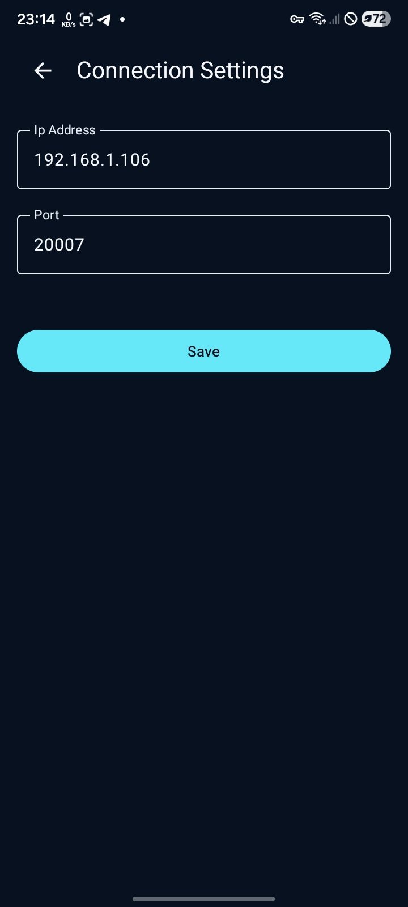

# ZvtPayment

[](https://developer.android.com/)
[](https://kotlinlang.org/)
[](https://developer.android.com/jetpack/compose)
[](https://developer.android.com/tools/releases/platforms)
[](https://opensource.org/licenses/MIT)

**ZvtPayment** is a modern, premium Android application designed to facilitate point-of-sale (POS) interactions via the **ZVT Payment Protocol**. It allows merchants to key in transaction amounts on a custom-designed, tactile, and highly responsive digital numpad and transmit purchase requests to a ZVT-compliant card reader terminal over a local TCP/IP connection.

Developed entirely using modern Android standards including **Jetpack Compose (Material 3)**, state hooks, and coroutines, this repository encapsulates clean-architecture practices and integrates with a standalone payment library module (`zvtlib`).

---

## 📸 Screenshots

Here is a visual preview of the application showing the main layout, connection options, and settings:

| Main View | Settings & Customization | Connection Settings |
| :---: | :---: | :---: |
|  |  |  |

---

## 🌟 Key Features

*   **📱 Tactile Numeric Numpad:** A bespoke, beautiful Material 3 dialpad representing currency inputs (limited to 2 decimal places) with dynamic backspace, decimal validation, and payment initiation buttons.
*   **🔌 ZVT Protocol Client:** Connects to standard card terminal hardware via socket connections over TCP. Manages connection states automatically and triggers purchase events using a precompiled library module (`zvtlib.aar`).
*   **🛠️ Configurable Network Interface:** A dedicated settings interface allowing developers and merchants to customize the IP Address and Port of the ZVT payment terminal server.
*   **🌓 Unified Theme Controller:** Fully integrated light and dark theme switching persisting across app restarts using local `SharedPreferences` configuration.
*   **⚙️ Clean Modern Codebase:** Utilizes Compose Scaffold, reactive state handling via Kotlin flows and coroutine scopes, and structured UI components (`CircleButton`, `NumpadText`, etc.).

---

## 🏗️ Architecture & File Structure

The project has a modular layout separating the host UI/routing from the low-level communication logic:

```
ZvtPayment/
├── app/
│   ├── libs/
│   │   └── zvtlib.aar             # Precompiled ZVT Payment SDK
│   └── src/main/java/com/justme/zvtpayment/
│       ├── MainActivity.kt        # Application Entry Point & Theme Setup
│       ├── presentation/
│       │   ├── components/        # Reusable UI Atoms (Buttons, Input Display)
│       │   └── views/             # Screen Containers
│       │       ├── connect_screen/# ZVT Server & Port configuration Screen
│       │       ├── main_screen/   # Calculator Calculator keyboard & payment initiator
│       │       └── settings/      # Navigation hub & Theme toggle
│       └── ui/theme/              # Material 3 Styling and Color Tokens
```

---

## 🔌 Inside the ZVT Protocol Integration

The core protocol commands are handled via the local `zvtlib.aar` framework. To initialize a payment sequence, the app spins up a TCP client targeting the saved terminal configuration:

```kotlin
// Retrieve configured network endpoints
val ip = themePrefs.getString("server_address", "192.168.178.203")
val port = themePrefs.getInt("server_port", 20007)

// Instantiate and initiate purchase
val zvt = ZVTClient(host = ip, port = port)
if (!zvt.isConnected()!!) {
    zvt.connect()
}
val response = zvt.purchase(amount)
```

---

## 🚀 Quick Setup & Installation

### Requirements
- **Android Studio** (Koala | 2024.1.1 or higher recommended)
- **JDK 17** configured in your IDE
- **Android Device or Emulator** running API Level 30+ (Android 11+)
- **ZVT terminal hardware** (or simulator) on the same local network

### 1. Clone the Repository
```bash
git clone https://github.com/durdyshev/ZvtPayment.git
cd ZvtPayment
```

### 2. Add dependencies
Ensure the required `zvtlib.aar` is present in the `app/libs/` directory.

### 3. Build & Run
Compile the application using Gradle or Android Studio directly:
```bash
./gradlew assembleDebug
```
Deploy the package directly to your connected device:
```bash
./gradlew installDebug
```

---

## ⚙️ Configuration

1. Launch **ZvtPayment** on your Android device.
2. Tap the **Settings Cog (⚙️)** in the top right corner.
3. Select **ZVT Connection Settings**.
4. Enter the **IP Address** and **Port** of your payment terminal (defaults are `192.168.178.203` and `20007`).
5. Tap **Save** to persist the configuration.
6. Return to the main screen, enter a test amount, and press **Payment** to dispatch the transaction.

---

## 📄 License

This project is licensed under the MIT License - see the [LICENSE](LICENSE) file for details.
